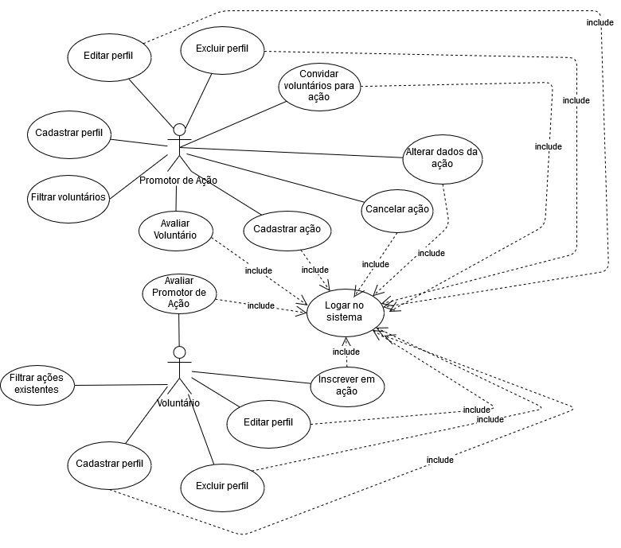

# Projeto LigAção

Projeto para a disciplina de Domínios de Software - 2019/02 - do curso de Engenharia de Software ([INF/UFG](http://www.inf.ufg.br/)).

## Índice

- [Identificação dos componentes do grupo](#identificação-dos-componentes-do-grupo)
- [Problema](#problema)
- [Objetivo](#objetivo)
- [Identificação dos componentes do sistema](#identificação-dos-componentes-do-sistema)
- [Identificação dos usuários finais](#identificação-dos-usuários-finais)
- [Fontes de requisitos](#fontes-de-requisitos)
- [Requisitos funcionais](#requisitos-funcionais)
- [Diagrama de casos de uso](#diagrama-de-casos-de-uso)
- [Casos de uso detalhados](#casos-de-uso-detalhados)
- [Programação das entregas dos requisitos](#programação-das-entregas-dos-requisitos)

## Identificação dos componentes do grupo

Desenvolvido pelos alunos: [@alicefrancener](https://github.com/alicefrancener/), [@caiobas](https://github.com/caiobas), [@danielfreitasbs](https://github.com/danielfreitasbs) e [@ottoleggio](https://github.com/ottoleggio).

## Problema

Há várias instituições, ONGs e grupos de voluntários que promovem ações/eventos visando impactar positivamente a sociedade. Para que essas ações aconteçam são necessários voluntários, __encontrar voluntários adequados é uma dificuldade para as instituições__.

Há pessoas que têm vontade de participar de ações voluntárias porém enfrentam a __dificuldade de não ter conhecimento adequado de quais ações existem, de que tipo, quando acontecem e como participar__.

Há também pessoas que já têm conhecimento das ações e já são voluntários em instituições, porém para as quais a __instituição/ONGs têm uma dificuldade em saber e gerenciar quem irá participar da ação__.

## Objetivo

O sistema __LigAção__ será uma plataforma no qual instituições possam promover suas ações e na qual pessoas possam ter conhecimento dessas ações e possam se inscrever para participar delas.

## Identificação dos componentes do sistema

O sistema será uma plataforma web com portabilidade para ambientes mobile.

Utilizaremos a API de login do Facebook para facilitar o login na plataforma.

Legislação pertinente ao domínio:

- Lei sobre voluntariado (Lei nº 9.608, de 18/02/1998)
- Lei sobre OSCIP (Lei nº 9.790, de 23/03/1999).

## Identificação dos usuários finais

- Instituições, movimentos sociais, ONGs e grupos de voluntários que desejam divulgar suas ações sociais para atingir mais pessoas. Esses usuários são identificados no projeto como **Promotores de Ações**.
- Voluntários e pessoas interessadas em participar presencialmente de ações voluntárias. São identificados no projeto como **Voluntários**

| Necessidades gerais | Usuário
| - | -
| Cadastrar ações | Promotores de ações
| Gerenciar quem poderá participar das ações | Promotores de ações
| Ter conhecimento de quais ações existem em sua cidade |Voluntários
| Escolher ações de acordo com seu interesse | Voluntários
| Obter informações sobre a ação (data, hora, local, etc) | Voluntários
| Se inscrever em ações | Voluntários

## Fontes de requisitos

| Fonte | Técnica de coleta | Motivação
| - | - | -
Voluntários e promotores de ações | Questionário-online | O questionário nos permite atingir várias pessoas usando somente uma técnica
Voluntários e promotores de ações |  Entrevistas | Com entrevistas, podemos ter maior compreensão das reais necessidades de ações dos usuários, validar e refinar requisitos
Promotores de ações1| Observação direta de divulgação de ações na internet | Ao analisar como as ações são divulgadas atualmente poderemos compreender melhor de que forma nosso sistema pode ajudar, que lacuna poderia preencher
Sistemas existentes que conectam voluntários à instituições2 | Análise de concorrência | A observação de sistemas que já existem dentro do domínio nos permite analisar principais funções existentes e se atendem necessidades dos usuários
Sistemas para divulgar eventos3 | Análise de concorrência | Ações voluntárias têm características similares à eventos gerais (congressos, palestras, workshops). Dessa forma, observar sistemas que servem para divulgar eventos nos permite obter as funcionalidades gerais necessárias para promoção de eventos e inscrição de pessoas.

1 Lista de promotores de ações: [Projeto Solidarie](https://www.instagram.com/projetosolidaire/), [Ensinando Abraçar](https://www.instagram.com/ensinandoabracar), [Goiânia Invisível](https://www.instagram.com/invisivelgo/), [Pão com Amor](https://www.instagram.com/paocomamor), [Grupo Miau AuAu](https://www.instagram.com/grupomiauauau/), [Nós + Árvores](https://www.instagram.com/nosmaisarvores/), [EcomAmor](https://www.instagram.com/ecomamor/), Banho do Bem, Vida Lata  
2 Lista de sistemas que conectam voluntários à instituições: [Sistema Voluntário](https://sistemavoluntario.v2v.net/pt-BR/aggregators/2442604a-22ec-410a-84a1-7c9e9e8d6d65), [Ação Voluntária](https://www.acaovoluntaria.org.br/), [Voluntários](https://voluntarios.com.br/), [Parceiros Voluntários](http://www.parceirosvoluntarios.org.br/), [Volunteer Match](https://www.volunteermatch.org), [GiveGab](https://www.givegab.com/)  
3 Lista de sistemas para divulgar eventos e nos quais as pessoas podem se inscrever: [Sympla](https://www.sympla.com.br/), [Eventuzz](https://www.eventuzz.com/events), [Eventbrite](https://www.eventbrite.com.br/), [Meetup](https://www.meetup.com/pt-BR/)

## Requisitos funcionais

__RF__ _<número único do requisito funcional>_: __como__ _<ator/(sub)sistema>_ , __desejo__ _<ação/objetivo/meta>_ , __para que__ _<razão/benefício>_.

__RF01__: __como__ Promotor de ações, __desejo__ cadastrar uma nova ação, __para que__ possa recrutar novos candidatos. São os dados que comporão o perfil da ação: nome do Promotor da ação, categoria da ação, nome da ação, local, data, horário início, horário fim, descrição e imagem descritiva da ação (opcional). As categorias de ações serão: Projeto Social, Ambiental, Animal, Educação, Esportes, Arte e Cultura.

__RF02__: __como__ Promotor de ações, __desejo__ alterar dados (categoria da ação, nome da ação, descrição e imagem descritiva da ação) de uma ação existente, __para que__ possa adequá-la a
algum imprevisto.

__RF03__: __como__ Promotor de ações, __desejo__ cancelar uma ação existente com opção de adicionar uma justificativa, __para que__ possa ajustá-la a algum imprevisto que a impossibilite de acontecer.

__RF04__: __como__ Promotor de ações, __desejo__ poder filtrar os candidatos de acordo com os atributos de seus perfis, __para que__ eu possa selecionar as pessoas que se encaixam ao trabalho. Alguns atributos dos candidatos que poderão ser filtrados serão: idade, cidade, profissão, categorias de interesse do candidato, ações realizadas e avaliação do voluntário.

__RF05__: __como__ Promotor de ações, __desejo__ poder convidar os candidatos para minhas ações de acordo com os atributos de seus perfis, __para que__ eu possa aumentar as chances de ter pessoas que mais se encaixam ao trabalho.

__RF06__: __como__ Promotor de ações, __desejo__ poder avaliar os voluntários através de uma pontuação de 0 a 5 em critérios (dedicação, pontualidade), para que no futuro aquele candidato possa ser selecionado de acordo com seu histórico.

__RF07__: __como__ Voluntário, __desejo__ filtrar ações disponíveis de acordo com seus atributos, __para que__
possa selecionar uma que mais me agrada. Alguns atributos das ações que poderão ser filtrados serão: cidade, categoria da ação, nome do promotor de ações.

__RF08__: __como__ Voluntário, __desejo__ poder me inscrever em ações, __para que__ possa participar como voluntário. Para se inscrever será necessário nome e e-mail do voluntário.

__RF09__: __como__ Voluntário, __desejo__ poder avaliar as organizações após a realização da ação, __para que__ no futuro aquela organização possa ser selecionada de acordo com seu histórico.

__RF10__: __como__ Promotor de ações, __desejo__ criar (_create_) meu perfil no sistema LigAção, __para que__ possa utilizar todas as funcionalidades do sistema. O promotor de ações poderá se cadastrado como pessoa física ou jurídica. Seguem os dados que comporão o perfil do promotor de ações: nome de pessoa física responsável, CPF do responsável, nome do promotor de ações, tipo de promotor (pessoa física ou jurídica), CNPJ do promotor (obrigatório somente se for pessoa jurídica), razão social (obrigatório somente se for pessoa jurídica), data da fundação, foto de perfil, links para redes sociais e site (opcionais), categorias das ações realizadas, descrição geral, telefone, endereço, nome de usuário, e-mail e senha.

__RF11__: __como__ Promotor de ações, __desejo__ ler (_read_) meu perfil no sistema LigAção, __para que__ possa listar meus dados e verificar se estão corretos. Os dados retornados serão os mesmos citados no RF10.

__RF12__: __como__ Promotor de ações, __desejo__ editar (_update_) meu perfil no sistema LigAção, __para que__ possa corrigir e manter atualizados meus dados. Os dados que poderão ser atualizados serão os mesmos citados no RF10.

__RF13__: __como__ Promotor de ações, __desejo__ excluir (_delete_) meu perfil no sistema LigAção, __para que__ possa sair do sistema e não deixar os meus dados pessoais disponíveis. Ao excluir o perfil, todas as ações relacionadas ao Promotor serão excluídas também.

__RF14__: __como__ Voluntário, __desejo__ criar (_create_) meu perfil no sistema LigAção, __para que__ possa utilizar todas as funcionalidades do sistema. Seguem os dados que comporão o perfil voluntário: nome, foto de perfil, links para redes sociais e site (opcionais), endereço (cidade e estado), profissão/área de atuação, categorias de ações de interesse, nome de usuário, e-mail e senha.

__RF15__: __como__ Voluntário, __desejo__ ler (_read_) meu perfil no sistema LigAção, __para que__ possa listar meus dados e verificar se estão corretos. Os dados retornados serão os mesmos citados no RF14.

__RF16__: __como__ Voluntário, __desejo__ editar (_update_) meu perfil no sistema LigAção, __para que__ possa corrigir e manter atualizados meus dados. Os dados que poderão ser atualizados serão os mesmos citados no RF14.

__RF17__: __como__ Voluntário, __desejo__ excluir (_delete_) meu perfil no sistema LigAção, __para que__ possa sair do sistema e não deixar os meus dados pessoais disponíveis.

## Diagrama de casos de uso

Os atores do diagrama abaixo se resumem aos promotores de ações (instituições, movimentos, ONGs e grupos de voluntários que desejam criar ações na plataforma) e aos Voluntários que são pessoas que desejam ter conhecimento e possivelmente se inscrever em ações voluntárias.

O promotor de ações deverá criar um perfil no sistema (cadastro) para poder publicar ações. Esse perfil poderá ser editado e excluído pelo promotor de ações. Além disso, ele poderá também filtrar voluntários (por características do perfil) e convidá-los para ações. As ações publicadas no sistema poderão ser alteradas ou canceladas. E os voluntários que participarem das ações poderão ser avaliados ao final da ação pelo promotor da ação.

Os voluntários poderão criar um perfil no sistema e editá-lo e excluí-lo quando quiserem. Poderão também pesquisar por ações de acordo com características (tipo de ação, data de realização, local) e se inscrever. Também poderão avaliar os promotores de ação após participarem de alguma ação.

## Casos de uso detalhados

### RF01: Cadastrar ação

**Ator**: Promotor de ação  
**Pré-condições**: Promotor de ação cadastrado e logado no sistema  
**Pós-condições**: A ação foi cadastrada  
**Fluxo principal**:  

1. O promotor de ação solicita a criação de uma nova ação
2. O sistema exibe um formulário com os atributos de ações a serem preenchidos: nome do Promotor da ação, nome da ação, local, data, horário início, horário fim, descrição, imagem descritiva da ação (opcional), categoria da ação (opções: projeto social, ambiental, animal, educação, esportes, arte e cultura)
3. O promotor de ação preenche e submete os dados da ação
4. O sistema envia mensagem solicitando confirmação da criação da ação
5. O sistema registra as informações e envia mensagem ao promotor de ação indicando que a ação foi registrada com sucesso

**Fluxos alternativos**:

- No passo 1 do fluxo principal, caso o promotor de ação ainda não possua um perfil, o sistema retornará uma mensagem indicando a realização do cadastro como promotor de ação
- No passo 3 do fluxo principal, caso o promotor não preencha algum dado obrigatório o sistema retornará uma mensagem indicando o(s) campo(s) ausente(s)
- No passo 4 do fluxo principal, se o promotor de ação desistir de cadastrar a ação será direcionado para a página inicial

### RF10: Criar perfil de Promotor de Ação

**Ator**: Organização ou pessoa física  
**Pré-condições**: ator promotor de ação com acesso ao cadastro de perfil  
**Pós-condições**: ator com perfil de __Promotor de Ação__ devidamente cadastrado
**Fluxo principal**:  

1. Ator aciona solicitação de cadastro
2. Exibição de opção de tipo de perfil do promotor(Pessoa Física ou Pessoa Júridica);
3. Exibido o formulário de cadastro para __Promotor de Ação__;
4. Ator preenche os atributos corretamente;
5. Ator submete formulário de cadastro;
6. Entrega de mensagem para o ator confirmar o cadastro ou cancelar a ação;
7. Entrega de mensagem de sucesso da ação;
8. Formulário é fechado.

**Fluxos alternativos**:

- No passo 3, caso o ator tenha escolhido a opção **Pessoa Física**, será exibido o formulário com os seguintes atributos: 
    - Tipo de promotor(Pessoa Física ou Pessoa Jurídica);
    - Nome da pessoa física responsável pelo registro do perfil;
    - CPF do responsável;
    - Data de Nascimente;
    - Foto de perfil;
    - Links para redes sociais(opcional);
    - Categoria de ações realizadas;
    - Descrição geral;
    - Telefone;
    - Endereço;
    - Nome de usuário;
    - Email;
    - Senha;
- No passo 3, caso o ator tenha escolhido a opção **Pessoa Jurídica**, será exibido o formulário com os seguintes atributos:
    - Tipo de promotor(Pessoa Física ou Pessoa Jurídica);
    - Nome da pessoa física responsável pelo registro do perfil;
    - CPF do responsável;
    - CNPJ;
    - Razão Social;
    - Data de Fundação;
    - Foto de perfil;
    - Links para redes sociais(opcional);
    - Categoria de ações realizadas;
    - Descrição geral;
    - Telefone;
    - Endereço;
    - Nome de usuário;
    - Email;
    - Senha;
- No passo 5, caso o ator não tenha preenchido todos atributos obrigatórios(todos atributos não marcados como opcional), será entregue uma mensagem para o preenchimento de todos atributos e o formulário terão os dados atribuidos aos atributos limpos. 
- No passo 7, caso o ator tenha acionado a ação de **confirmar** o cadastro no passo 6, será entregue uma mensagem de sucesso.
- No passo 7, caso o ator tenha acionado a ação de **cancelar** o cadastro no passo 6, será entregue uma mensagem de sucesso na ação de cancelamento.

### RF12: Editar perfil de Promotor de Ação

**Ator**: Promotor de Acao
**Pré-condições**: Perfil de promotor de acao com registro realizado
**Pós-condições**: ator com perfil de __Promotor de Ação__ com os dados alterados
**Fluxo principal**:  

1. Ator aciona solicitacao de alteracao de perfil;
2. Exibicao de formulario para abrir sessao no sistema. Formulario contem atributos usuario e senha;
3. Ator informa usuario e senha;
4. Validacao de registro de perfil.
5. Exibicao de formulario com atributos que compõe o perfil do __Promotor de Acao__;
6. Exibicao de solicitacao para alteracao de cada atributo que compõe o perfil. Texto solicita a confirmacao se o ator deseja alterar determinado atributo;
7. Exibicao de texto solicitando encerramento da edicao de perfil;

**Fluxos alternativos**:

- No passo 4, caso o usuario ou senha esteja incorreto será retornada uma mensagem de finalizacao da operacao e a rotina se encerrará;
- No passo 6, caso o ator opte pela *nao alteracao* do atributo, os dados não seram alterados;
- NO passo 6, caso o ator opte pela *alteracao* do atributo. O mesmo deverá entrar com o novo dado e este substituir o anterior;
- No passo 7, caso o ator opte pelo *cancelamento* da edicao do perfil nenhum dado será alterado;
- No passo 7, caso o ator opte pela *confirmacao* da edicao do perfil, todos os dados que foram alterados deverão ser registrados.

### RF13: Excluir perfil de Promotor de Ação

**Ator**: Promotor de Acao
**Pré-condições**: Ator ter registro em base de dados
**Pós-condições**: ator com perfil de __Promotor de Ação__ com os dados excluidos da base de dados e assim também suas ações
**Fluxo principal**:  

1. Ator aciona a alternativa de exclusao do perfil;
2. Exibicao de mensagem para selecao de tipo de perfil do promotor da acao;
3. Ator seleciona a alternativa do tipo de perfil que deseja excluir;
4. Exibicao de formulario para abrir sessao no sistema. Formulario contem atributos usuario e senha;
5. Ator informa usuario e senha;
6. Exibicao de mensagem solicitando confirmacao da acao de exclusao;
7. Realizada a busca e exclusao de dados do promotor da base de dados;
8. Exibicao de mensagem de status da acao;

**Fluxos alternativos**:

- No passo 5, caso o usuario ou senha esteja incorreto será retornada uma mensagem de finalizacao da operacao e a rotina se encerrará;
- No passo 6, caso o ator opte pela **nao exclusao** do perfil, os dados não seram alterados e a rotina se encerrará;

## Programação das entregas dos requisitos

| Identificador | Assunto | Iteração | Fonte do requisito | Última atualização
| - | - | - | - | -
| RF01 | Cadastrar ação (Promotor) | #1 | Motivação inicial | 02/11/2019
| RF02 | Editar ação (Promotor) | #1 | Motivação inicial | 02/11/2019
| RF08 | Inscrever em ação (Voluntário) | #1 | Resultados da entrevista | 02/11/2019
| RF10 | Criar perfil (Promotor) | #1 | Resultados da entrevista | 02/11/2019
| RF12 | Editar perfil (Promotor)| #1 | Resultados da entrevista | 02/11/2019
